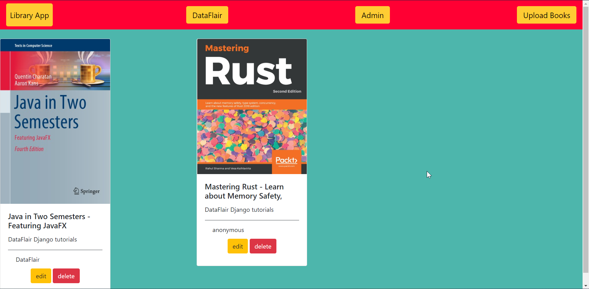

# LibraryApp
This is a Application, which can perform CRUD operations on Books of a library.  
This repository contains the code of the article on this url : https://data-flair.training/blogs/django-crud-example/ 
All my blogs on Django Framework can be found on dataflair's django series, and more repositories for the articles can be found on my Gtihub profile. 

### Hope you get some value from these blogs. Thank you

# Preview of the Application 

### Author: Karan Mittal 

https://data-flair.training/blogs/django-crud-example/

pip install pymysql

python3 manage.py makemigrations

python3 manage.py migrate   

python3 manage.py createsuperuser

python3 manage.py runserver

