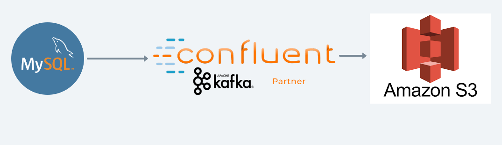

### How to run this project?
Project directory  contain two important file
1. producer.py :
> This file read data from MYSQL database and send them to kafka topics
2. conusmer.py
> This file read data from Kafka topic and overwrites record to s3 bucket

This project Diagram



# Project Structure
```
|->logs                             # contains log file
|->src                              #root folder for source code
    |->config                       # configuration related code
        |->__init__.py
        |->environment.py           #All environment variable will be made available by this module
        |->spark_manager.py         #customize spark session will be created 
    |->consumer
        |->__init__.py
        |->kafka_reader.py          #Reading data from kafka topic and writing to s3 bucket
    |->enitity
        |->__init__.py              #Structure for all required dataset or dataframe
    |->producer
        |->__init__.py
        |->kafka_writer.py          #Reading data from MYSQL and writing to kafka topic
    |->utils
        |->__init__.py              #All helper function such reading data from MYSQL 
    |->__init__.py                  # dot env module help us to read all env variable from .env file
```


Required environment variable to setup this project
create a file .env and provide all this information

```
KAFKA_TOPIC_FACT_SALE=""
KAFKA_TOPIC_DIM_EMP=""
KAFKA_TOPIC_DIM_CUST=""
KAFKA_TOPIC_DIM_PROD=""
KAFKA_TOPIC_DIM_DATE=""
KAFKA_TOPIC_DIM_LOC=""
KAFKA_BOOTSTRAP_SERVER=""
KAFKA_CLOUD_API_KEY=""
KAFKA_CLOUD_API_SECRET=""
MYSQL_URI="jdbc:mysql://mysql:3306/classicmodels?useSSL=false"
MYSQL_USER_NAME="root"
MYSQL_PASSWORD="example"
AWS_ACCESS_KEY_ID=""
BUCKET_NAME=""
AWS_SECRET_ACCESS_KEY=""
```